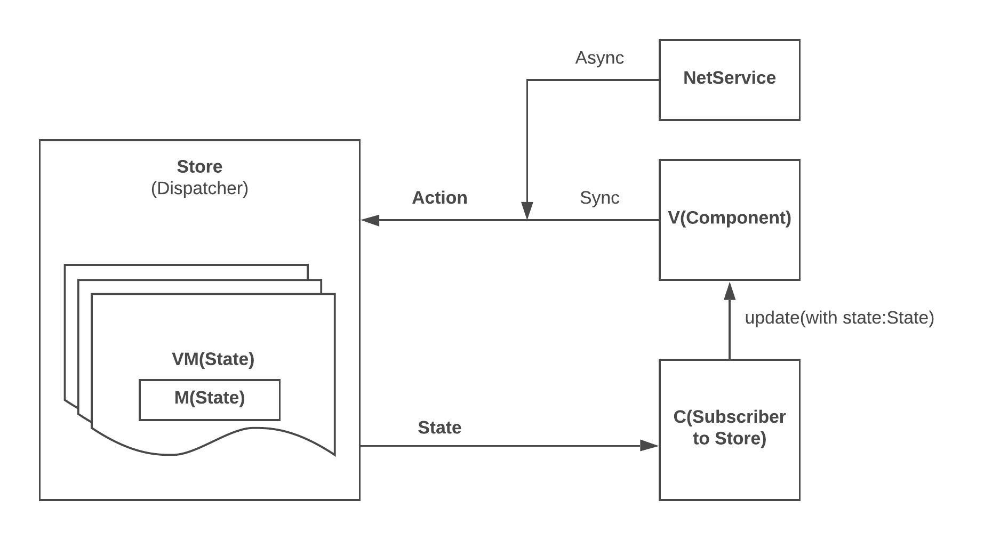

# ReactiveListViewKit

- **MVVM + Redux reactive facade ViewKit** for Feed based app development
- **Eliminates Massive View Controller** in unidirectional Action / State flow

### Massive View Controller Terminator

- No more `UICollectionViewDataSource`/`UICollectionViewDelegate` overhead
- No more giant if statements to manage model / cell mapping, action handling
- No more coupling Delegation pattern: 1 to n Action-driven pattern, more loosely coupled
- FLUX one way data flow - solves core problems of MVC:
  - Central mediator
  - Chaining callback propagation
  - Data binding

### FeedList/FeedDetails FacadeViewClass wraps complex UICollectionView

- Implement Instagram FeedList within 50 lines of code
- Embedded `HorizontalSectionAdapterView` simplifies nested horizontal ListView implementation within 10 lines code
- Adaptive to various CellComponent classes:
  - `UICollectionViewCell`
  - `UIView`
  - `UIViewController` - handles domained actions of complex Cell
- Embedded convenient actions set
  - `CZFeedListViewAction` - `pullToRefresh`/`loadMore` etc.

### Unidirectional Data Flow

- **Dispatcher:** Propagates domained actions

- **Store:** Maintains `State` tree

- **Subscriber:** Subscribes to `Store` and updates Components with new `State`

- **Action:** Action driven - more loosely coupled pattern than `Delegation` pattern
- **State:**
  - Waterfall reacting flow
  - Composition: `RootState` is composed of `Substates`
  - Reacts to `Action` and outputs new `State`, propagates `Action` to children nodes via `State` tree

### Automatic Batch Update

- Smart Diff Algorithm for ListView incremental updates on top of `Longest Common Subsequence` - O(n) time complexity
- Perform `Insert/Delete/Move/Update` of Sections/Cells based on internal models diff algorithm

### Declarative/Stateful/Immutable/Predictable

- Efficient ViewModel tree diff algorithm, no more imperative manual cells update code

  

### [Instagram Demo](https://github.com/showt1me/CZInstagram)

Implemented on top of **ReactiveListViewKit**

